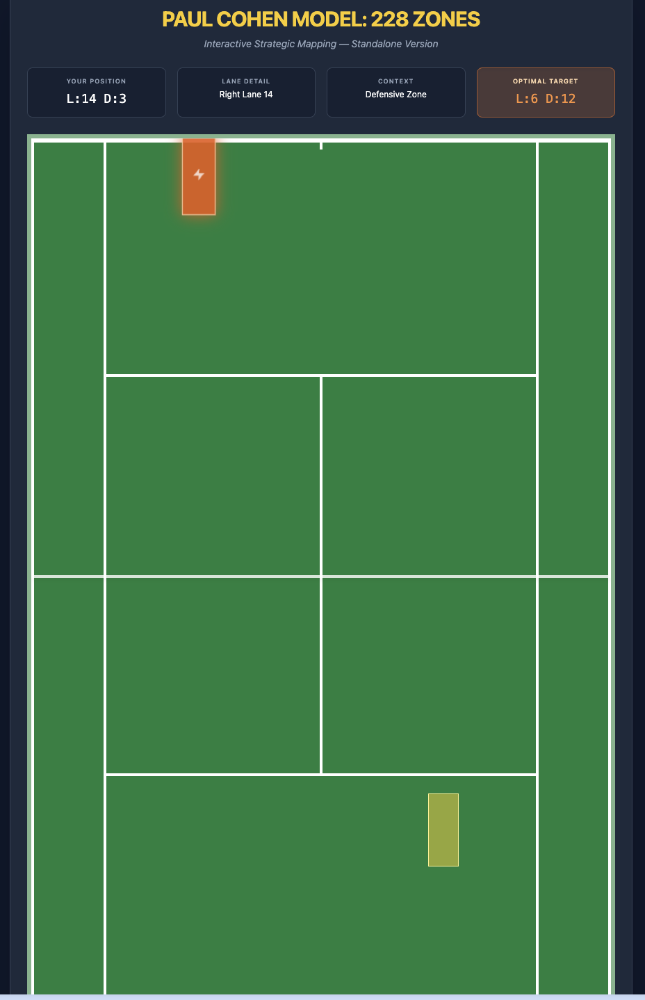

# Tennis Court 228: The Paul Cohen Model

## Overview

Welcome to **Tennis Court 228**, an interactive web-based implementation of the legendary **Paul Cohen Model**—a revolutionary, mathematically-driven approach to tennis strategy and tactical excellence.

This is not just a tennis training tool; it is a **chessboard of tennis possibilities**. The Paul Cohen Model represents decades of research, mathematical analysis, and practical application by one of the most respected technical and tactical minds in the game.

## 📖 [View Complete Paul Cohen Model Slides (PDF)](TennisCourt228.pdf)

Explore the comprehensive breakdown of the 228-zone system, tactical principles, and mathematical foundations in our detailed presentation.

---

## The Paul Cohen Philosophy

### The Court as a Chessboard

The core principle of the Cohen philosophy is that a tennis court is **not just an open space**—it is a **chessboard**. By dividing the court into 228 distinct "shots" or "zones," the system removes guesswork from the game. Instead of hitting the ball back on instinct, a player learns the mathematically **correct shot for every possible situation**.

### The 228 "Shots"

The model breaks down the game into **228 separate scenarios** based on:

1. **Your position** on the court
2. **Where the ball is landing** on your side
3. **The height and speed** of the incoming ball
4. **The optimal target zone** on the opponent's side to maximize your winning percentage

This comprehensive breakdown transforms intuition into **statistical certainty**.

### The 11 "Sub-Games"

The 228 zones are categorized into **11 sub-games**, each with its own set of probabilities:

- The Serve
- The Return
- The Transition Game
- The Forehand Rally
- The Backhand Rally
- The Volley
- The Lob
- The Overhead
- The Break Points
- The First Strike
- The Finishing Positions

Each sub-game has a specific strategic framework designed for "**First-Strike Tennis**"—using mathematics to end the point in your favor within the first few hits.

### Why 228?

The number **228** represents the exhaustive calculation of every viable "high-percentage" move available to a player in match situations. By mastering these 228 possibilities, a student of the Cohen model isn't just playing on instinct; they are playing with **statistical certainty and probabilistic advantage**.

---

## The Mathematics Behind the 228: Connected Tennis Principles

The Paul Cohen 228-Zone Model is built on **"Connected Tennis" principles**, where every coordinate on your side of the court is mathematically linked to an optimal target on the opponent's side. The logic relies on three primary mathematical operations: **Lane Mirroring**, **Depth Reversal**, and **Coordinate Mapping**.

### 1. Lane Mirroring (Horizontal Strategy)

This formula calculates the "Most Correct" cross-court response. In a 19-lane system, the center lane is Lane 10. To find the geometric opposite, we use the constant of 20:

$$L_{target} = 20 - L_{source}$$

**Example:** If you are pulled wide to the left into Lane 1, the calculation is $20 - 1 = 19$. Your target is Lane 19 (the opposite deep corner).

**Logic:** This maximizes the distance the ball travels over the lowest part of the net and forces the opponent to cover the maximum amount of ground.

### 2. Depth Scaling (Vertical Strategy)

The model divides the court into 12 depth zones. The formula for the target depth ($D_{target}$) depends on your tactical situation (Defensive, Neutral, or Offensive).

#### Defensive Reversal ($D_{source} \leq 3$)

When you are pushed deep behind the baseline, the goal is to "reset" the point by hitting as deep as possible.

$$D_{target} = 12$$

#### Neutral Build ($D_{source} = 4 \text{ to } 6$)

When hitting from the baseline area, you aim for the "Safe Deep" zone to prevent the opponent from attacking.

$$D_{target} = 11$$

#### Offensive Finish ($D_{source} > 6$)

If the ball is short, the geometry allows for sharper angles and lower depths, though the standard high-percentage Cohen target remains deep in the corner to remove the opponent's options.

### 3. Grid Coordinate Mapping

To render this in code, the 2D coordinates must be mapped to a 1D array index for the zones array. Since the grid is generated from the top-left (Opponent's baseline) down to the bottom-right (Player's baseline), we use:

$$Index = ((DEPTHS_{total} - D_{target}) \times LANES_{total}) + (L_{target} - 1)$$

### Summary Table of Mathematical Logic

| Your Lane ($L_s$) | Your Depth ($D_s$) | Calculation | Target Lane | Target Depth |
|---|---|---|---|---|
| 1 (Wide Left) | 2 (Deep) | $20 - 1 = 19$ | 19 (Wide Right) | 12 (Deep) |
| 10 (Center) | 5 (Baseline) | $20 - 10 = 10$ | 10 (Down T) | 11 (Deep) |
| 15 (Right) | 6 (Short) | $20 - 15 = 5$ | 5 (Inside-Out) | 11 (Safe Deep) |

---

## The Legacy at Court 228

Today, Jon Cohen carries on his father Paul Cohen's legacy at his private facility in Hawthorne, NY. The **"Connected Tennis" model** is used to train elite juniors and professionals, teaching them to see the court as a grid where every movement has a **specific purpose**.

This methodology has produced countless champions and fundamentally changed how elite tennis is taught at the highest levels.

---

## About This Implementation

This interactive visualization provides:

- **Interactive Court Visualization**: See all 228 zones mapped on a digital tennis court
- **Tactical Learning**: Understand the positioning, zones, and high-percentage shots
- **Strategic Reference**: Access the complete breakdown of all sub-games and their zones
- **Visual Navigation**: Explore the court from both player and opponent perspectives

---

## Features

✅ **Interactive 228-Zone Tennis Court Map**  
✅ **Responsive Design** (Desktop & Mobile)  
✅ **Zone-by-Zone Tactical Breakdown**  
✅ **Sub-Game Classification**  
✅ **Visual Probability Indicators**  
✅ **Tactical Reference Guide**  

---

## Getting Started

1. **Open** `TennisCourt228.html` in your web browser
2. **Explore** the different zones on the interactive court
3. **Study** the tactical breakdowns and zone classifications
4. **Apply** these principles to your game

---

## Understanding the Zones

Each of the 228 zones represents a unique tactical situation. The visualization helps you:

- Identify **where you are positioned** on the court
- See **optimal target zones** for your next shot
- Understand the **statistical probability** of winning the point
- Learn the **sequencing** of high-percentage shots

---

## The Mathematics of Tennis

The Paul Cohen Model is built on a foundation of:

- **Shot selection analysis** from thousands of professional matches
- **Probabilistic modeling** of point outcomes
- **Positional mapping** of every viable court location
- **Target zone optimization** for maximum winning percentage

This transforms tennis from an art into a **science-backed discipline**.

---

## Training Applications

Use the 228-zone model to:

1. **Improve Decision-Making** - Know the correct shot choice in any situation
2. **Increase Win Percentage** - Play high-percentage tennis consistently
3. **Develop Pattern Recognition** - Internalize the zones and sub-games
4. **Master Tactical Sequencing** - Build points systematically
5. **Accelerate Learning** - Replace trial-and-error with proven methodology

---

## The Connected Tennis Approach

The modern "Connected Tennis" methodology integrates:

- **Technical Excellence** - Proper stroke production for each zone
- **Tactical Precision** - Correct shot selection based on the Paul Cohen Model
- **Mental Discipline** - Pattern recognition and decision-making
- **Physical Optimization** - Court positioning and movement efficiency

---

## References & Further Learning

For more information about the Paul Cohen Model and Connected Tennis:

- Train at **Court 228** in Hawthorne, NY
- Study under **Jon Cohen**, Paul Cohen's protégé
- Explore professional implementations in elite training academies

---

## Technology Stack

- **HTML5** - Semantic markup
- **Tailwind CSS** - Responsive styling
- **Vanilla JavaScript** - Interactive court visualization
- **SVG/Canvas** - Court rendering and zone visualization

---

## License & Usage

This implementation is created as an educational and training tool based on the Paul Cohen Model methodology.

---

## Contact & Support

For questions about the Paul Cohen Model, Court 228 methodology, or this visualization tool, please reach out to the Connected Tennis community.

---

**Master the 228. Master the game.**

*"Tennis is not luck—it is mathematics. The court doesn't lie."* — Paul Cohen Model Philosophy
